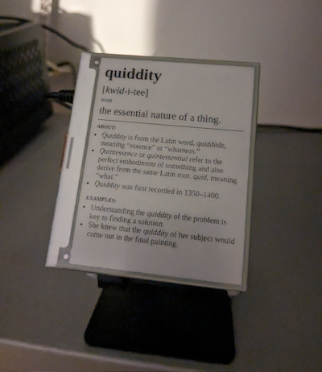

# Word of the day eInk display

Web scrape the word of the day from [dictionary.com](https://www.dictionary.com), get as json, format as minimal semantic html, save as image and display on a Pimoroni [Inky wHAT](https://shop.pimoroni.com/products/inky-what?variant=13590497624147)

